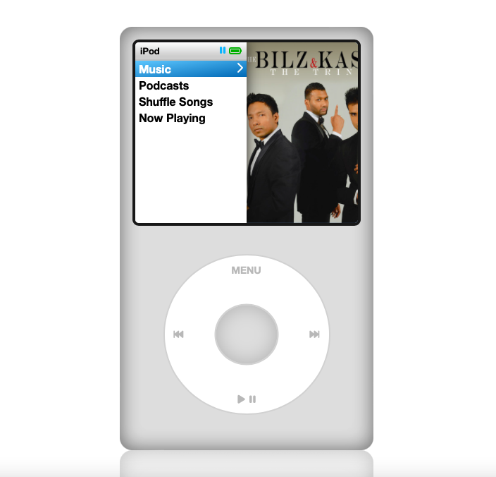

# iPodSimulator

This is an iPod themed music player, made using HTML, CSS and Vanilla JavaScript.

## Preview

Live Preview : https://plushexe351.github.io/iPodSimulator/

## Key Features

- Sleep / Wake with animated bootscreen
- Play and browse through songs with an iPod like experience
- Use buttons on screen to Forward/Previous/Play/Pause/Shuffle songs
- There is Keyboard support as well. Check the instruction panel to check key binding
- iPod sleeps when user's focus goes away from browser or changes tab

Features under development :

- Tap on progress bar to go to that part of the song
- Forward fast song
- Previous fast song

## Note

This Website is not perfect. If you come across a bug or want to contribute, feel free to send pull requests.
